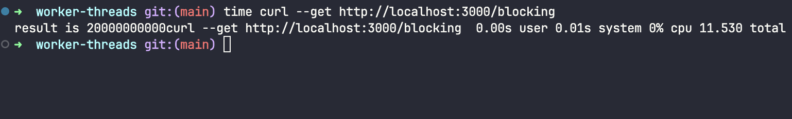
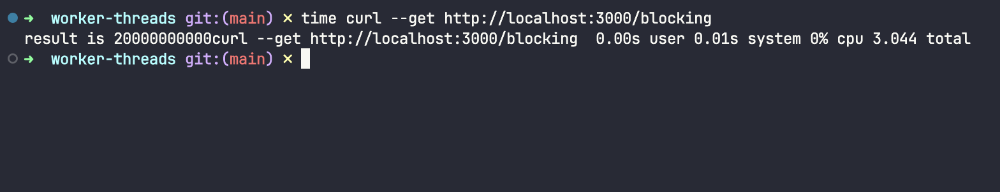

# Worker Threads Performance Comparison

This project demonstrates the impact of using **Node.js Worker Threads** for CPU-intensive operations.

Worker Threads allow JavaScript code to execute in parallel on multiple CPU cores, preventing the main event loop from being blocked by expensive computations. They are recommended for CPU-bound workloads, while asynchronous APIs remain the best option for I/O-bound operations. 

---

## Without Worker Threads

When the computation runs on the main thread:

- The Event Loop is blocked until the task finishes.
- Incoming HTTP requests must wait.
- The application becomes less responsive under heavy CPU load.
- Throughput decreases significantly as concurrent requests increase.

### Result

As shown in the benchmark, the server processes requests sequentially because the CPU-intensive task occupies the main thread.

---

## With Worker Threads

When using Worker Threads:

- CPU-intensive work is delegated to background threads.
- The main thread remains available to receive new requests.
- Multiple CPU cores can be utilized.
- Overall responsiveness and scalability improve considerably.

### Result

The benchmark shows that requests complete much faster because expensive computations are executed in parallel without blocking the Event Loop.

---

## Performance Comparison

| Without Worker Threads | With Worker Threads |
| ---------------------- | ------------------- |
| Main thread blocked | Main thread remains responsive |
| Sequential CPU execution | Parallel CPU execution |
| Poor scalability | Better scalability |
| Lower throughput | Higher throughput |
| Higher response time | Lower response time |

---

## When Should You Use Worker Threads?

Worker Threads are ideal for **CPU-bound tasks**, such as:

- Image processing
- Video transcoding
- Cryptography
- Data compression
- Large JSON parsing
- Machine Learning inference
- Mathematical calculations

They are **not recommended** for I/O-bound operations (database queries, HTTP requests, file system operations), since Node.js already handles these efficiently using its asynchronous event loop. :contentReference[oaicite:1]{index=1}

---

## Conclusion

This benchmark clearly demonstrates that **Worker Threads significantly improve performance for CPU-intensive workloads** by moving heavy computation away from the main thread.

The result is:

- ✅ Better application responsiveness
- ✅ Improved throughput
- ✅ Lower request latency
- ✅ More efficient utilization of multi-core processors
