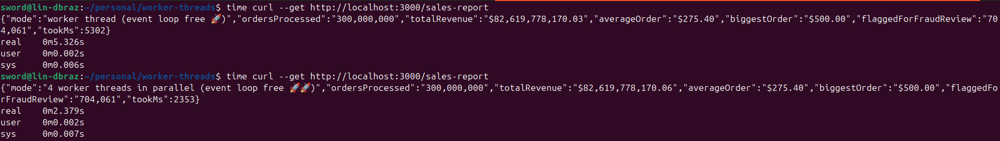

# 🛍️ Black Friday, 300 Million Orders, and a Frozen API

> A real-world demo of **Node.js Worker Threads**: how one CPU-heavy endpoint can freeze your entire API — and how to fix it.

## The story

It's the Monday after Black Friday. Your e-commerce API is happily serving customers when the finance team asks for the sales report: **300 million orders** need to be aggregated — total revenue, average ticket, biggest order.

A developer adds a `/sales-report` endpoint that crunches the numbers... on the main thread.

Suddenly, **the whole store goes down**. Not because of traffic. Not because of the database. Because Node.js runs JavaScript on a **single thread**, and while that report is being computed, the Event Loop can't do anything else — not even answer `/health`.

## Try it yourself

```bash
npm install
npm start
```

**1. The store works fine:**

```bash
curl http://localhost:3000/health
# instant: {"status":"ok","message":"store is up, customers are buying 🛒"}
```

**2. Ask for the report on the main thread... and try `/health` in another terminal:**

```bash
curl http://localhost:3000/sales-report/blocking   # terminal 1
curl http://localhost:3000/health                  # terminal 2 — HANGS 😱
```

Every customer request is stuck behind the report. The API is effectively down.

**3. Same report, but on a Worker Thread:**

```bash
curl http://localhost:3000/sales-report            # terminal 1
curl http://localhost:3000/health                  # terminal 2 — instant 🚀
```

The heavy computation runs on a background thread. The Event Loop stays free and customers never notice.

**4. Bonus — split the work across 4 workers:**

```bash
npm run start:parallel
curl http://localhost:3000/sales-report
```

The 300 million orders are divided into chunks, processed **in parallel on multiple CPU cores**, and merged. Same result, roughly **2x faster** on this machine (~5s → ~2.5s), and still non-blocking.

## Benchmark

| | Without Worker Threads | With Worker Threads |
| --- | --- | --- |
| Event Loop | Blocked | Free |
| `/health` during report | Hangs | Instant |
| CPU usage | 1 core | All cores (parallel version) |
| Customer experience | Store "down" | Business as usual |

Real run — same 300 million orders, same totals: **~5.3s** on a single worker thread vs **~2.4s** split across 4 parallel workers:



## When should you reach for Worker Threads?

Worker Threads are for **CPU-bound** work:

- 📊 Report generation / data aggregation (this demo)
- 🖼️ Image resizing & processing
- 🔐 Password hashing, encryption
- 🗜️ Compression
- 📄 Parsing huge CSV/JSON files
- 🤖 ML inference

They are **not** for I/O-bound work (database queries, HTTP calls, file reads) — Node's async Event Loop already handles those brilliantly without extra threads.

> **Rule of thumb:** if the task *waits*, use async I/O. If the task *computes*, use a Worker Thread.

## Project structure

```
analytics.js            # the CPU-heavy "crunch the orders" logic (shared)
index.js                # API: blocking vs single worker thread
worker.js               # worker that processes the full dataset
index-four-workers.js   # API: dataset split across 4 parallel workers
four-workers.js         # worker that processes one chunk of the dataset
```
