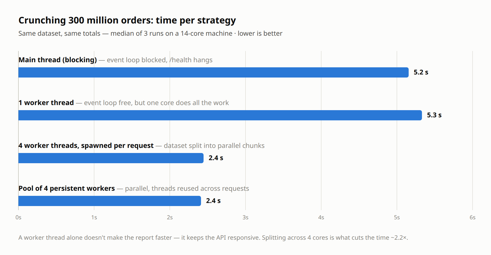

# 🛍️ Black Friday, 300 Million Orders, and a Frozen API

> A real-world demo of **Node.js Worker Threads**: how one CPU-heavy endpoint can freeze your entire API — and how to fix it.
>
> Inspired by the video [How to use Multithreading with "worker threads" in Node.js?](https://youtu.be/MuwJJrfIfsU)

## The story

It's the Monday after Black Friday. Your e-commerce API is happily serving customers when the finance team asks for the sales report: **300 million orders** need to be aggregated — total revenue, average ticket, biggest order.

A developer adds a `/sales-report` endpoint that crunches the numbers... on the main thread.

Suddenly, **the whole store goes down**. Not because of traffic. Not because of the database. Because Node.js runs JavaScript on a **single thread**, and while that report is being computed, the Event Loop can't do anything else — not even answer `/health`.

## Try it yourself

```bash
npm install
npm start
```

**1. The store works fine:**

```bash
curl http://localhost:3000/health
# instant: {"status":"ok","message":"store is up, customers are buying 🛒"}
```

**2. Ask for the report on the main thread... and try `/health` in another terminal:**

```bash
curl http://localhost:3000/sales-report/blocking   # terminal 1
curl http://localhost:3000/health                  # terminal 2 — HANGS 😱
```

Every customer request is stuck behind the report. The API is effectively down.

**3. Same report, but on a Worker Thread:**

```bash
curl http://localhost:3000/sales-report            # terminal 1
curl http://localhost:3000/health                  # terminal 2 — instant 🚀
```

The heavy computation runs on a background thread. The Event Loop stays free and customers never notice.

**4. Bonus — split the work across 4 workers:**

```bash
npm run start:parallel
curl http://localhost:3000/sales-report
```

The 300 million orders are divided into chunks, processed **in parallel on multiple CPU cores**, and merged. Same result, roughly **2x faster** on this machine (~5s → ~2.5s), and still non-blocking.

**5. Production-shaped — a pool of persistent workers:**

```bash
npm run start:pool
curl http://localhost:3000/sales-report
```

The parallel version above has a hidden problem: it spawns **4 new workers on every request**. The pool version pre-spawns 4 workers at boot and reuses them, with a FIFO queue when all workers are busy.

## Why the pool matters: bounded concurrency

Here's a real measurement — OS thread count of the Node process under **6 concurrent** report requests:

| | Baseline | Under 6 concurrent requests |
| --- | --- | --- |
| Spawn-per-request (`start:parallel`) | 7 threads | **31 threads** (6 × 4 workers) |
| Worker pool (`start:pool`) | 11 threads | **11 threads** (flat) |

The spawn-per-request design creates threads proportional to traffic — under real load that's a resource-exhaustion incident, not a performance optimization. The pool caps CPU-bound concurrency at pool size no matter how many requests arrive; excess requests wait in the queue instead of oversubscribing the CPU.

This repo hand-rolls a ~50-line pool (`worker-pool.js`) to show the mechanics. In production, use [piscina](https://github.com/piscinajs/piscina) — same pattern, battle-tested.

## Why 4 workers ≠ 4x faster

The honest numbers from this machine (14 cores available):

- 1 worker: ~5s. 4 workers: ~2.4s. That's **~2x, not 4x**.
- Spawning all 4 workers costs only **~34ms** — spawn overhead is *not* the explanation.

What actually eats the speedup:

1. **Memory bandwidth** — 4 cores hammering RAM share one memory bus. CPU-bound loops that touch a lot of data saturate bandwidth before they saturate cores.
2. **Amdahl's law** — chunk splitting, message passing, and merging the partial reports are sequential and don't parallelize.
3. **Thermal throttling** — during back-to-back benchmark runs, the *same code* measured anywhere from 2.4s to 6.3s as the CPU heated up and clocked down. Parallel work generates heat; sustained all-core clocks are lower than single-core clocks.

The lesson: **threads are not free and speedup is not linear. Measure — then measure again under sustained load.**

## Benchmark

| | Without Worker Threads | With Worker Threads |
| --- | --- | --- |
| Event Loop | Blocked | Free |
| `/health` during report | Hangs | Instant |
| CPU usage | 1 core | All cores (parallel version) |
| Customer experience | Store "down" | Business as usual |

Report time per strategy — same 300 million orders, same totals, median of 3 runs on this machine:



Note that the single worker takes the *same* ~5.3s as the blocking version — a worker thread doesn't make the computation faster, it just keeps the event loop free. The parallel versions are what cut the time to ~2.4s.

Real run — same 300 million orders, same totals: **~5.3s** on a single worker thread vs **~2.4s** split across 4 parallel workers:


## When should you reach for Worker Threads?

Worker Threads are for **CPU-bound** work:

- 📊 Report generation / data aggregation (this demo)
- 🖼️ Image resizing & processing
- 🔐 Password hashing, encryption
- 🗜️ Compression
- 📄 Parsing huge CSV/JSON files
- 🤖 ML inference

They are **not** for I/O-bound work (database queries, HTTP calls, file reads) — Node's async Event Loop already handles those brilliantly without extra threads.

> **Rule of thumb:** if the task *waits*, use async I/O. If the task *computes*, use a Worker Thread.

## Project structure

```
analytics.js            # the CPU-heavy "crunch the orders" logic (shared)
index.js                # API: blocking vs single worker thread
worker.js               # one-shot worker that processes the full dataset
index-four-workers.js   # API: dataset split across 4 workers, spawned per request
four-workers.js         # one-shot worker that processes one chunk
index-worker-pool.js    # API: pool of 4 persistent workers, reused across requests
pool-worker.js          # persistent worker that receives tasks via messages
worker-pool.js          # minimal hand-rolled worker pool (use piscina in prod)
```
